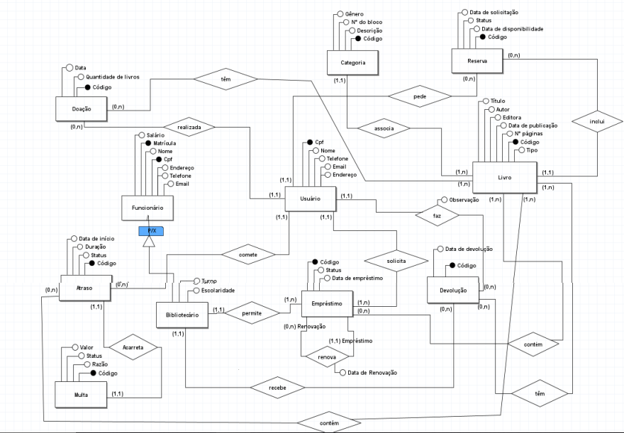

# Projeto de Banco de Dados - Disciplina de Banco de Dados I

Este projeto foi desenvolvido como parte da disciplina de Banco de Dados I do curso de Análise e Desenvolvimento de Sistemas. O projeto abrange o levantamento de requisitos, a modelagem do banco de dados, consultas SQL, mapeamento entidade-relacionamento e scripts de criação e povoamento de tabelas.

Este projeto foi desenvolvido utilizando o sistema de gerenciamento de banco de dados relacional PostgreSQL.

**Nota:** Certifique-se de ter o PostgreSQL instalado e configurado ou outro SGBD relacional para executar esses scripts com sucesso.

## Estrutura do Projeto

- Levantamento de Requisitos
- Diagrama Entidade-Relacionamento (DER)
- Mapeamento Lógico
- Descrição das Consultas
- Mapeamento Entidade-Relacionamento
- Scripts SQL
  - Criação de Tabelas
  - Povoamento de Tabelas
  - Índices
  - Consultas

## Levantamento de Requisitos

- A biblioteca possui alguns funcionários encarregados diariamente para atender
aos usuários e alguns para manter a limpeza do ambiente. Para cada
funcionário é necessário informações como nome, CPF, salário, endereço, email,
telefone e matrícula. Os bibliotecários devem possuir informações específicas
sobre o seu turno e a escolaridade. Além disso, o bibliotecário será responsável
exclusivamente por permitir os empréstimos, e cada empréstimo precisa conter
a data em que foi realizado, a quantidade de livros, o código identificador, status
e os livros emprestados.

- Novos livros que aparecem na biblioteca devem ser cadastrados, para cada livro
deve possuir dados como título, autor, editora, data de publicação, número de
páginas e código identificador. Cada livro deve estar associado a uma categoria,
e nessa categoria deve conter o gênero, número do bloco em que está
localizada dentro da biblioteca e descrição.

- Os usuários que desejarem solicitar um empréstimo é preciso se cadastrar no
sistema, e esse sistema irá armazenar o nome, CPF, endereço, email e
telefone. Cada usuário pode em cada empréstimo levar no máximo 3 livros.
Caso o prazo de entrega não seja suficiente para o uso dos livros, um
empréstimo feito pode se renovar caso o usuário solicite.

- É ocorrente o recebimento de doações dentro da biblioteca, e para que fique
registrado essas doações no sistema, o bibliotecário deve armazenar a data da
doação do livro e a quantidade de livros. Ademais, o nome, telefone, email, cpf e
o endereço do usuário que realizou a doação naquele dia.

- No sistema também é possível que quando chegar a data da devolução do
livro/livros emprestados ao usuário, caso o usuário devolva até a data limite será
armazenado a data da devolução, o bibliotecário que recebeu, livros
emprestados e observações como a falta de algum item do livro. Caso contrário,
o sistema deve adicionar um registro de atraso contendo informações como a data de início do atraso,
duração, usuário que atrasou a entrega e status. Para
caso de atraso será acarretado uma multa que deve ser armazenada com o
valor, a razão e o status.

- Para situações em que o usuário deseja um livro que já foi emprestado, será
possível que o usuário peça uma reserva para aquele livro. Na reserva deve ter
o usuário que solicitou, a data de solicitação, o status, a data em que o livro
estará disponível e o livro solicitado

## Diagrama Entidade-Relacionamento (DER)

</img>

## Mapeamento Lógico

O modelo lógico do banco de dados inclui as seguintes entidades:

- Usuário (CPF, nome, email, telefone, endereço)
- Funcionário (Matrícula, CPF, nome, email, telefone, salário, endereço)
- Bibliotecário (Matrícula, turno, escolaridade)
- Livro (Código, título, Autor, Editora, data_publicação, n°_páginas, tipo, CodCategoria)
- Categoria (Código, gênero, N°Bloco, descrição)
- Empréstimo (Código, status, data_empréstimo, CpfUsuário, MatBibliotecário)
- Devolução (Código, status, data_devolução, observação, CpfUsuario, MatBibliotecario)
- Reserva (Código, data_reserva, status, data_disponibilidade, CpfUsuario, codLivro)
- Atraso (Código, duração, status, data_inicio, CpfUsuario, CodMulta)
- Multa (Código, status, razão, valor)
- Doação (Código, Data, quant_livros, CpfUsuário)
- Devolução_Livro (CodDevolução, CodLivro)
- Empréstimo_Livro (CodEmprestimo, CodLivro)
- Renovações (codEmprestimo, codRenovação, data_Renovação)
- Atraso_Livro(codAtraso, codLivro)
- Doação_Livro (CodDoação. CodLivro)

## Contribuição

Se você deseja contribuir com este projeto, siga as diretrizes abaixo:

1. Faça um fork deste repositório.
2. Crie uma branch para sua contribuição: `git checkout -b sua-feature`.
3. Faça suas modificações e teste-as.
4. Envie um pull request para a branch principal.

Certifique-se de seguir as melhores práticas de desenvolvimento e manter a consistência com o estilo de código existente. Se possível, inclua uma descrição detalhada das mudanças que você fez e por que elas são relevantes para o projeto.

